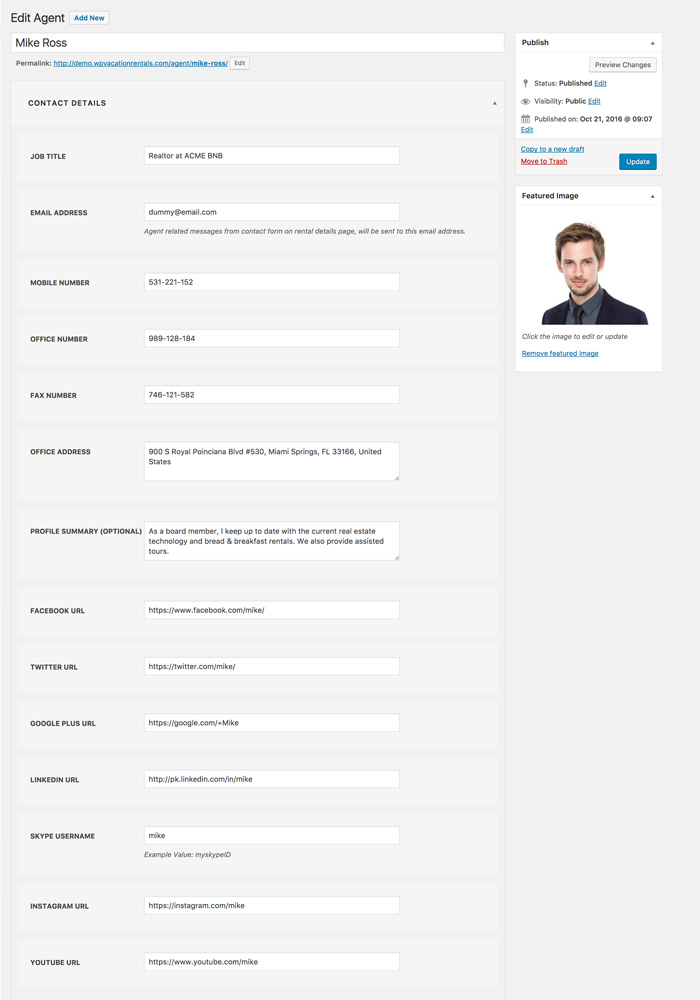

# AGENTS

!!!note ""
    Agents are realtors that put up rental properties for rent. 

## How to Add a Realtor Agent?

You can add a `Agent` (realtor) to your site by:

!!!summary ""
    - **ACCESS** WordPress admin dashboard.
    - **GO TO** `Vacation Rentals` > `Agents` menu.
    - **CLICK** `ADD NEW` button.

Fill in the following details and publish a new agent.

!!!summary ""
    - **Agent Title**.
    - **JOB TITLE**.
    - **EMAIL ADDRESS** — Agent related messages from contact form on rental details page, will be sent to this email - address.
    - **MOBILE NUMBER**.
    - **OFFICE NUMBER**.
    - **FAX NUMBER**.
    - **OFFICE ADDRESS**.
    - **PROFILE SUMMARY** (OPTIONAL).
    - **FACEBOOK URL**.
    - **TWITTER URL**.
    - **GOOGLE PLUS** URL.
    - **LINKEDIN URL**.
    - **SKYPE USERNAME** Example Value: `myskypeID`.
    - **INSTAGRAM URL**.
    - **YOUTUBE URL**.
    - **FEATURED IMAGE**: Add the `Agent`'s image as the featured image.

!!!tip ""
    An `Agent`'s filled profile looks like.

!!!success ""
    The `Agent`'s profile at the frontend looks like this.

