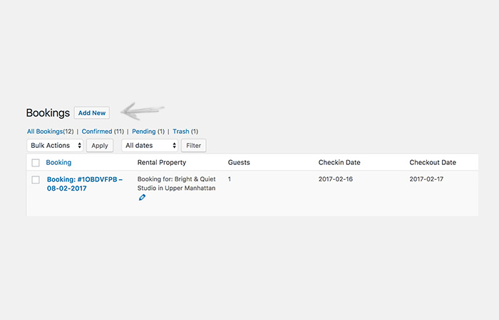

# Bookings

Users can book rentals listed on your site. Bookings are connected with each rentals as well. Bookings are very simple and easy to learn.

## How Does `Bookings` Work?

If you access your WordPress admin dashboard, you'll find the `Bookings` menu under the `Vacation Rentals` menu. As shown below.

### :fire: 1. Add a `Booking` Manually!

You can add a `Booking` manually by following these steps.

!!!summary ""
    - **ACCESS** WordPress admin dashboard.
    - **GO TO** `Vacation Rentals` > `Bookings` menu.
    - **CLICK** `ADD NEW` button.

!!!success ""
    - **TITLE** for the `Booking` will be auto generated.
    - **TITLE** consists of a random booking number with the date `Booking` was made. (This is not the `Booking` date, but when the `Booking` was made in WP). Date has international format, i.e. (Year-Month-Day).

To add the `Booking` you can fill the information asked of you on this screen.

!!!summary "BOOKING"
    - **BOOKING CONFIRMATION**: Select `Pending` or `Confirmed`.
    - **THE RENTAL**: Select the rental you are going to book. Selected Rental's value cannot be changed once it is set either manually or automatically. If you haven't added a rental then add a new RENTAL!

!!!summary "BOOKING INFORMATION"
    - **CHECKIN DATE** (Year-Month-Day). 
    - **CHECKOUT DATE** (Year-Month-Day).
    - **GUESTS** Add number of guests. Example Value: 2.
    - **NAME** Name of the person booking the rental. Booked By, E.g. John.
    - **EMAIL** ID of the person booking the rental. Example Value: john@gmail.com
    - **PRIVATE NOTE**: Keep a private note about this rental booking. This field will not be displayed anywhere else.

!!!NOTE
    - The first metabox (BOOKED RENTAL PROPERTY) will display the rental property that is being booked. When you haven't selected any rental property it will just show: ==- No rental property selected!==.
    - Once the rental property is selected then it will display that rental property with key details.

!!!success "BOOKED"
    
    After filling the data, press `Publish`. The rental is only `Booked` if you have selected `Confiremd`. Otherwise it will stay as a pending booking. Here's how it looks after getting published. 

        Check out the rental listing now shows at the top. 
        Also, check the private note that you can add for your team members to see.

### :fire: 2. Add a `Booking` Automatically!

Explained below; in [How Can a Customer Book a Rental?](#3-how-can-a-customer-book-a-rental)

### :fire: 3. How Can a Customer `Book` a Rental?

You or your customers can `Book` a rental from the frontend. Open a rental listing and book it from the sidebar by adding the following information.

!!!summary ""

    - **CHECK IN** date.
    - **CHECK OUT** date.
    - **GUESTS**: No. of guests.

!!!warning ""
    The booking gets submitted as a pending `Booking`. As shown below.

!!!success "CONFIRM THE BOOKING"
    To confirm the `Booking`; you have to access it, mark it as `Confirmed` and then `Publish` it. As shown below.

