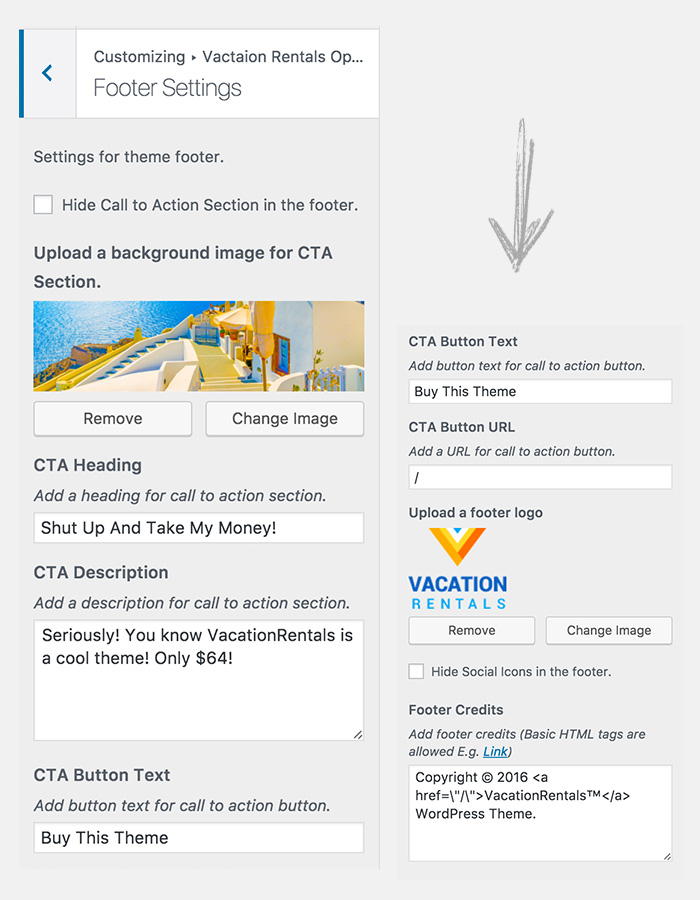

# CUSTOMIZATION

!!!summary "CUSTOMIZER"
    `VacationRentals` WordPress theme can be customized to suit your needs. It uses `WordPress Customizer` to help you customize the settings. 

## Customize
To customize `VacationRentals` theme, do the following.

!!!tip ""
    - **ACCESS** your WordPress site admin dashboard.
    - **OPEN** the `WordPress Customizer` by clicking **Appearance > Customize**.

---

## Vacation Rentals Options
Inside customizer you'll find a menu called `Vacation Rentals Options`. 
That's where the magic happens. You can customize this theme to suit your needs from this menu.

---

### Options
You can find the following options to customize this theme.

Let's take a look at all the available customization options.

---

#### :fire: Header Settings
Theme header can be customized from here. You can make following changes in the header:

!!!success ""

    - **HIDE** `Call Us` section.
    - **CHANGE** `Call Us` text.
    - **ADD** your phone number.
    - **CHANGE** `Mail Us` text.
    - **ADD** your email address.
    - **HIDE** social media icons.

---

#### :fire: Social Settings
Social settings can be customized from here. You can make following changes:

!!!success ""

    - **HIDE** a social icon.
    - **Add** your social links.

!!!tip "Social Icons are available for:"
    - Facebook
    - Twitter
    - Google Plus
    - Skype
    - LinkedIn
    - Youtube
    - Instagram
    - Vimeo

---

#### :fire: Single Rental Settings
Single Rental settings can be customized from here. You can make following changes:

!!!success ""

    - **HIDE** the Slider (for single rental listings).
    - **HIDE** the Address (for single rental listings).
    - **HIDE** the Price (for single rental listings).
    - **HIDE** the Beds (for single rental listings).
    - **HIDE** the Guests (for single rental listings).
    - **HIDE** the Baths (for single rental listings).
    - **HIDE** the Features (for single rental listings).
    - **HIDE** the Map (for single rental listings).
    - **HIDE** the Video (for single rental listings).
    - **HIDE** the Reviews (for single rental listings).
    - **HIDE** the Booking (for single rental listings).
    - **HIDE** the Agent (for single rental listings).
    - **HIDE** the Similar Rentals (for single rental listings).
    - **ADD** `Booking Widget` Description which **ADD** a general description for booking widget on all single rental listings.
    - **ADD** Booking Widget Points. Example: [vr_point] Your Point [/vr_point]. Which adds points at the end of the booking widget on all single rental listings.

---

#### :fire: Membership Settings
Membership settings can be customized from here. You can make following changes:

!!!success ""

    - **SELECT** the `Login` page 
        
         :point_right: (**ADD** a new page with `Login VR` page template and select it here).

    - **SELECT** the `Register` page 
        
         :point_right: (**ADD** a new page with `Register VR` page template and select it here).

    - **SELECT** the `Reset` page 
        
         :point_right: (**ADD** a new page with `Reset VR` page template and select it here).

---

#### :fire: Single Blog Post Settings
Single Blog Post settings can be customized from here. You can make following changes:

!!!success ""

    - **HIDE** the Author Box (for single blog posts)..

---

#### :fire: Category/Term Settings
Category/Term settings can be customized from here. You can make following changes:

!!!success ""

    - **UPLOAD** a default image for category/term!

---

#### :fire: Footer Settings
Footer settings can be customized from here. You can make following changes:

!!!success ""

    - **HIDE** Call to Action Section in the footer.
    - **UPLOAD** a background image for CTA Section.
    - **ADD** a heading for call to action section.
    - **ADD** a description for call to action section.
    - **ADD** button text for call to action button.
    - **ADD** a URL for call to action button.
    - **UPLOAD** a footer logo
    - **HIDE** Social Icons in the footer.
    - **ADD** footer credits (Basic HTML tags are allowed E.g. Link)

---

#### :fire: General Theme Settings
General Theme settings can be customized from here. You can make following changes:

!!!success ""

    - **DISABLE** Page Load Animation.
    - **DISPLAY** Page Load Animation.
    - **OPEN** Navigation Menu by default.
    - **DISPLAY** Navigation Menu by default.

That's all for customization of this theme. 

!!!warning ""
    Did we miss something? Let us know!
