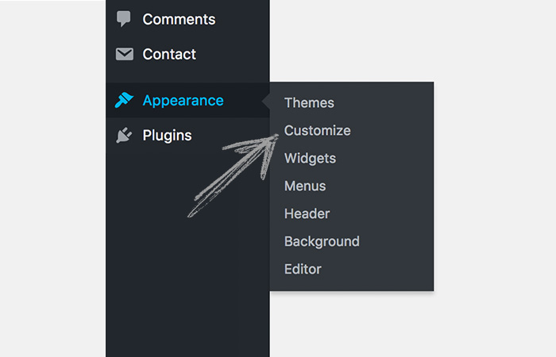
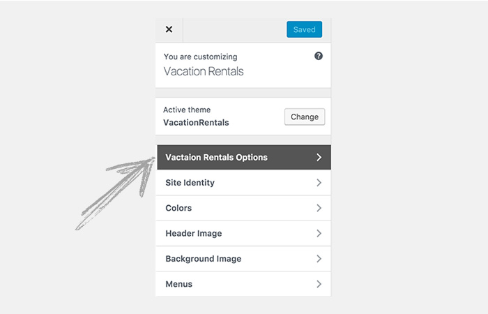
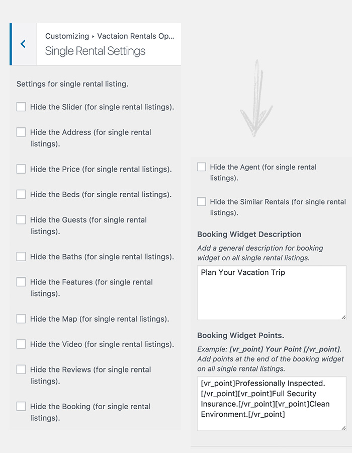
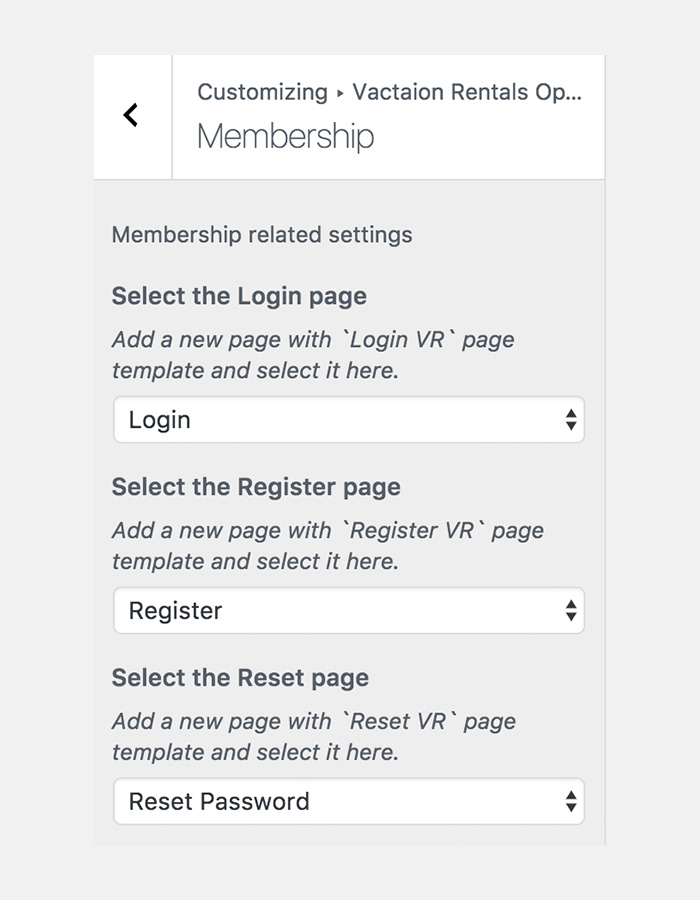
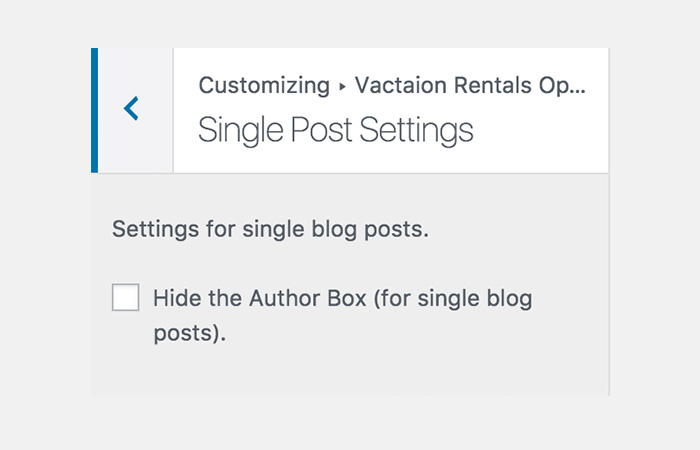
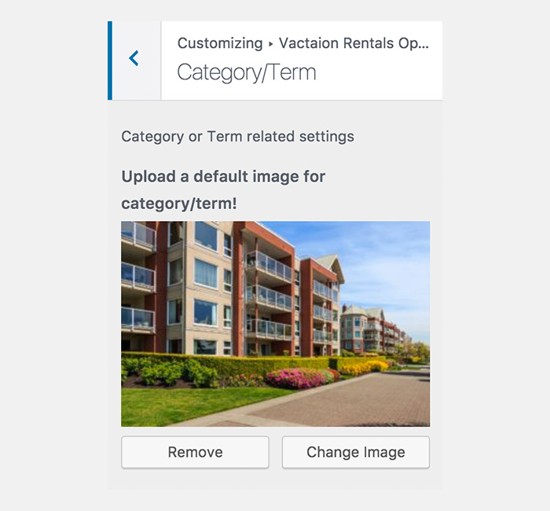

#CUSTOMIZATION

!!!summary "CUSTOMIZER"
    `VacationRentals` WordPress theme can be customized to suit your needs. It uses `WordPress Customizer` to help you customize the settings. 

## Customize
To customize `VacationRentals` theme, do the following.

- **ACCESS** your WordPress site admin dashboard.
- **OPEN** the `WordPress Customizer` by clicking **Appearance > Customize**.

---

## Vacation Rentals Options
Inside customizer you'll find a menu called `Vacation Rentals Options`. That's where the magic happens. You can customize this theme to suit your needs from this menu.

---

### Options
You can find the following options to customize this theme.

---

#### Header Settings
Theme header can be customized from here. You can make following changes in the header:

- HIDE `Call Us` section.
- Change `Call Us` text.
- Add your phone number.
- Change `Mail Us` text.
- Add your email address.
- HIDE social media icons.

---

#### Social Settings
Social settings can be customized from here. You can make following changes:

- **HIDE** a social icon.
- **Add** your social links.

:zap: **Social Icons** are available for:

- Facebook
- Twitter
- Google Plus
- Skype
- LinkedIn
- Youtube
- Instagram
- Vimeo

---

#### Single Rental Settings
Single Rental settings can be customized from here. You can make following changes:

- **HIDE** the Slider (for single rental listings).
- **HIDE** the Address (for single rental listings).
- **HIDE** the Price (for single rental listings).
- **HIDE** the Beds (for single rental listings).
- **HIDE** the Guests (for single rental listings).
- **HIDE** the Baths (for single rental listings).
- **HIDE** the Features (for single rental listings).
- **HIDE** the Map (for single rental listings).
- **HIDE** the Video (for single rental listings).
- **HIDE** the Reviews (for single rental listings).
- **HIDE** the Booking (for single rental listings).
- **HIDE** the Agent (for single rental listings).
- **HIDE** the Similar Rentals (for single rental listings).
- **ADD** `Booking Widget` Description which add a general description for booking widget on all single rental listings.
- **ADD** Booking Widget Points. Example: [vr_point] Your Point [/vr_point]. 
Which adds points at the end of the booking widget on all single rental listings.

---

#### Membership Settings
Membership settings can be customized from here. You can make following changes:

- **SELECT** the `Login` page 
    
     :point_right: (Add a new page with `Login VR` page template and select it here).

- **SELECT** the `Register` page 
    
     :point_right: (Add a new page with `Register VR` page template and select it here).

- **SELECT** the `Reset` page 
    
     :point_right: (Add a new page with `Reset VR` page template and select it here).

---

#### Single Blog Post Settings
Single Blog Post settings can be customized from here. You can make following changes:

- **HIDE** the Author Box (for single blog posts)..

---

#### Category/Term Settings
Category/Term settings can be customized from here. You can make following changes:

- **UPLOAD** a default image for category/term!

