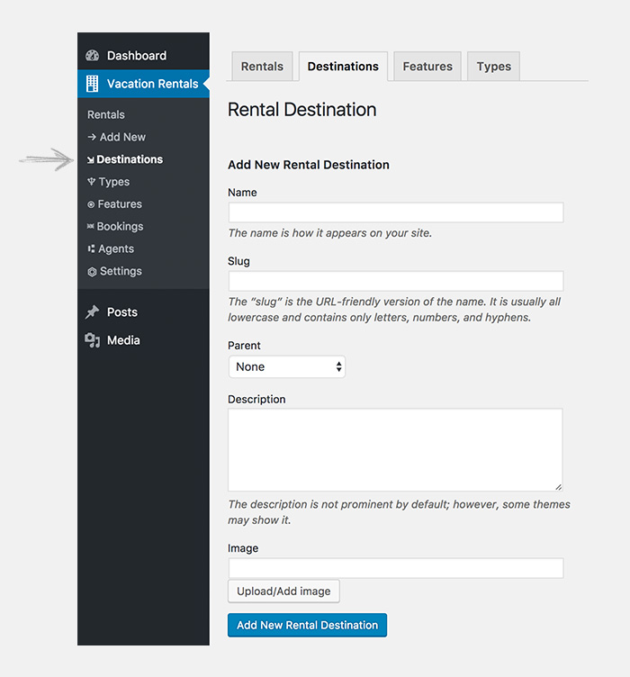

# RENTAL DESTINATIONS

!!!tip ""
    Rental destinations can be used to organize the rental listings.

## How to Add RENTAL DESTINATIONS?

To add a rental destination follow the steps as mentioned.

!!!summary "Add RENTAL DESTINATIONS"
    - **GO TO**: WordPress admin dashboard > `Vacation Rentals > DESTINATIONS`.
    - **NAME**: The name is how destination appears on your site.
    - **SLUG**: The “slug” is the URL-friendly version of the name. It is usually all lowercase and contains only letters, numbers, and hyphens.
    - **PARENT**: If the rental destination has a parent select it here. E.g. `New York` will have `USA` as its parent. 
    - **DESCRIPTION**: Add a description of your rental destination here.
    - **UPLOAD/ADD IMAGE**: Make sure the image is not too small and not too big. Recommended size is 1920px x 450px (Width x Height).
    - **CLICK**: `Add New Rental Destination`.

