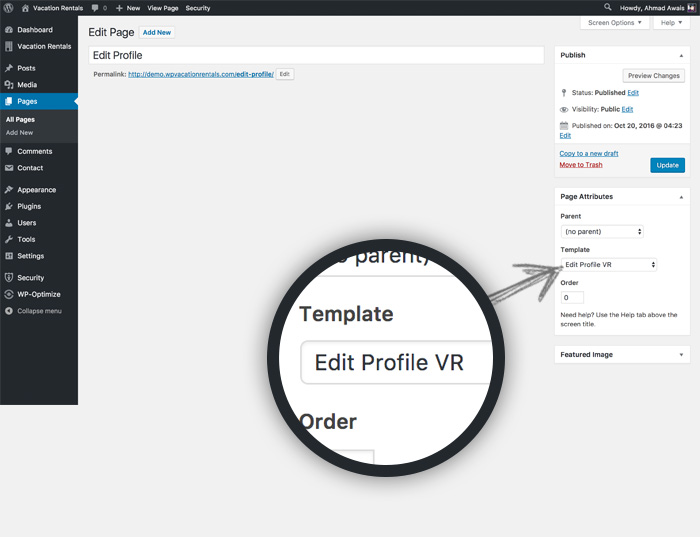

# EDIT PROFILE

To create membership on your site you need to add a `EDIT PROFILE` page. 

!!!summary "Add EDIT PROFILE page"
    - **GO TO** WordPress admin dashboard > `Pages > Add New`.
    - **SELECT** `EDIT PROFILE VR` template and `Publish` the page.

