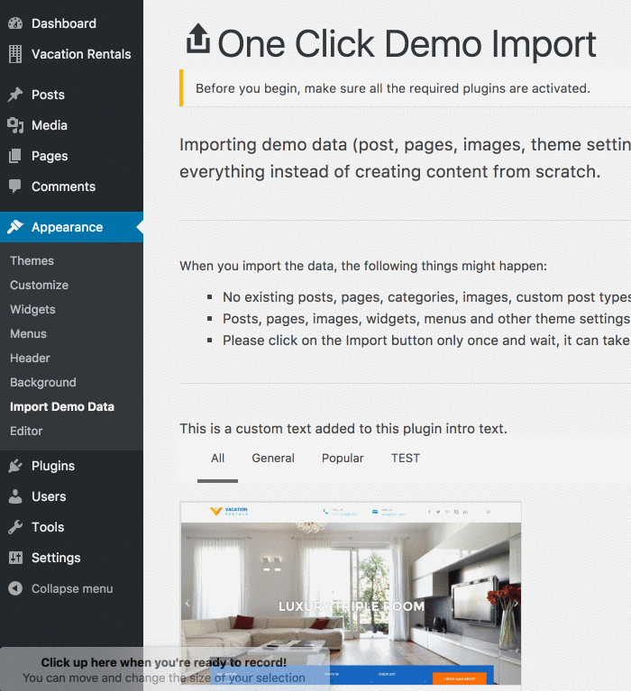

#THEME SETUP

## STEP #1— THEME INSTALLATION

!!! warning "INSTALL WORDPRESS"
    In start you must have a working version of WordPress already installed. For information in regard to installing the WordPress CMS, please see the WordPress Codex [Installing WordPress](http://codex.wordpress.org/Installing_WordPress).

Once you have a working version of WordPress, you need to do the following

1. **DOWNLOAD** the theme files (which contain both the theme and related documents).
2. **EXTRACT** the downloaded **zip** file.
3. **OPEN** the folder called `01- Theme` to find the installable theme zip file called **vr.zip**
4. **INSTALL** the theme by uploading **vr.zip** in your WordPress website.

!!!summary "RECAP" 
    So, it goes like this. You download the theme files you bought, you extract them in your computer and inside the theme folder `01- Theme` you find **vr.zip** file which is the theme file you need to upload in your WordPress.

###Install Theme Via WordPress Dashboard

- Access your WordPress site admin area. 
- Go to `Appearance > Themes` section.
- Click `Add New` button and select the ‘Upload Theme’ option
- Choose the **vr.zip** file and click `Install Now`
- Once the theme is uploaded you need to activate it.

---

###Alternative — Install Theme Via FTP

!!!tip "FTP (Alternative)"
    If you face any problem during upload through dashboard, please upload the theme using FTP as guided below.

- Extract the **vr.zip** file in your PC.
- Access your hosting server using an FTP client e.g. FileZilla.
- Go to the `wp-content/themes` folder of your WordPress installation.
- Upload the `vr` folder (you extracted) to the `wp-content/themes/` folder.
- Go to `WordPress Dashboard > Appearance > Themes` section and activate the theme.

## STEP #2— PLUGINS INSTALLATION

After activating the theme you need to install the required plugins. These plugins are needed for this theme to work. 

When you install and activate the theme, you will see this notice. 

:fire: Click “Begin installing plugin” and then select all plugins, select install and click `Apply` to install the required plugins. As shown in the GIF below.

:fire: Now that plugins are installed, click `Return to required plugin installer`, select `Activate` from the drop down and click `Apply` to activate these plugins. As shown in the GIF below.

## Step #3— Import Demo Data

You can quickly setup the entire theme just as shown in the the theme demo by importing demo data. It's pretty easy. All you have to do is:

:fire: **Go to**: `WordPress Admin dashboard > Appearance > Import Demo Data`.

:fire: **Import** a demo from available choices and click `Yes Import!`. It may take up to five minutes to import the data. You can go and have coffee while your site gets ready. 

:fire: Once the demo import says **That's it, all done!** your demo import is complete. Go ahead, and customize (`Appearance > Customize`) your theme to your will!

!!!warning ""
    If you end up with some kind of error on this step, make sure you try once again. If that doesn't work, then send what you see as an error as a support ticket to us.

!!!note "NOTE"
    Importing demoo data (post, pages, images, theme settings, ...) is the easiest way to setup your theme.  It will allow you to quickly edit everything instead of creating content from scratch.

