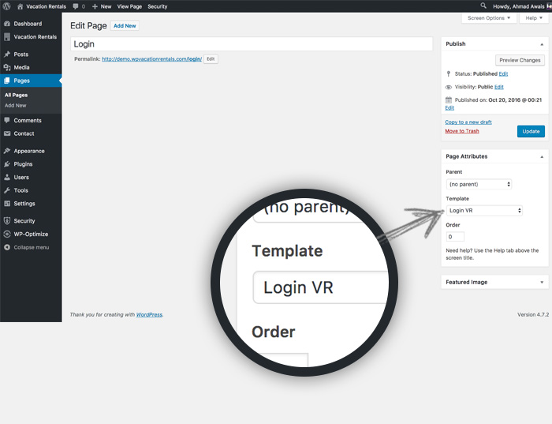

# LOGIN

To create membership on your site you need to add a `Login` page. 

!!!summary "Add LOGIN page"
    - **GO TO** WordPress admin dashboard > `Pages > Add New`.
    - **SELECT** `LOGIN VR` template and `Publish` the page.
    - **CONFIGURE**: Set the login page in `Appearance > Customize > Vacation Rentals Options > Membership` — [check documentation](/customization/#membership-settings)!

