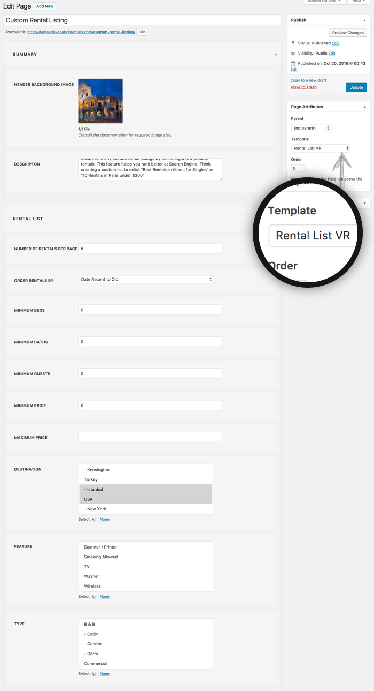

# RENTALS LIST

You can create as many custom rentals listings as you want. 

!!!tip ""
    A rental list page helps you to curate custom rentals listing based features like beds, baths, price, guests, destinations, etc. Create as many custom rental listings by collecting a few popular rentals. This feature helps you rank better at Search Engine. Think creating a custom list to enlist "Best Rentals in Miami for Singles" or "10 Rentals in Paris under $300"

!!!summary "Add RENTALS LIST"
    - **GO TO** WordPress admin dashboard > `Pages > Add New`.
    - **SELECT** `RENTAL LIST VR` template and `Publish` the page.
    - **HEADER BACKGROUND IMAGE**: Add header background. Make sure the image is not too small and not too big. Recommended size is `1920px x 450px` (Width x Height).
    - **DESCRIPTON**: Add description to the custom rentals list page.
    - **NUMBER OF RENTALS PER PAGE**: Any number e.g. 6.
    - **ORDER RENTALS BY**

            MINIMUM BEDS
            MINIMUM BATHS
            MINIMUM GUESTS
            MINIMUM PRICE
            MAXIMUM PRICE

    - **DESTINATIONS**: Press & hold ⌘ Command (on Mac) or CTRL (on Windows) to select multiple destinations.
    - **FEATURES**: Press & hold ⌘ Command (on Mac) or CTRL (on Windows) to select multiple features.
    - **TYPES**: Press & hold ⌘ Command (on Mac) or CTRL (on Windows) to select multiple types.

