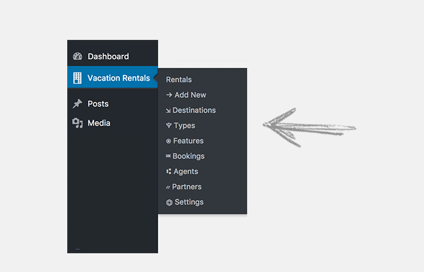
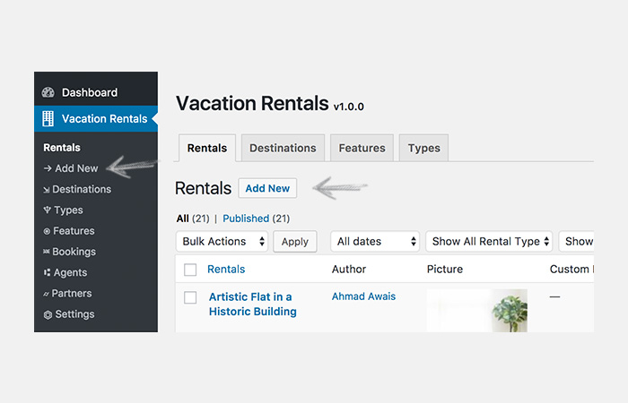
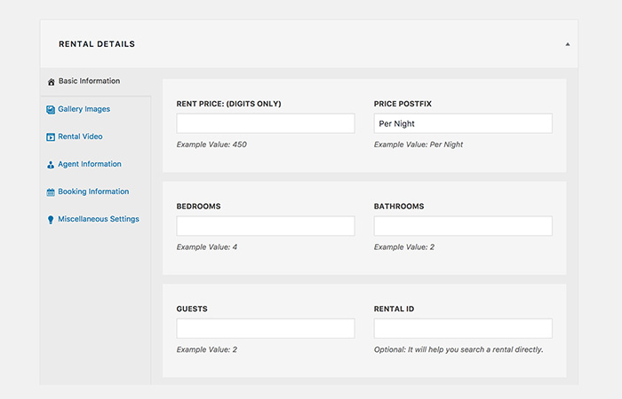
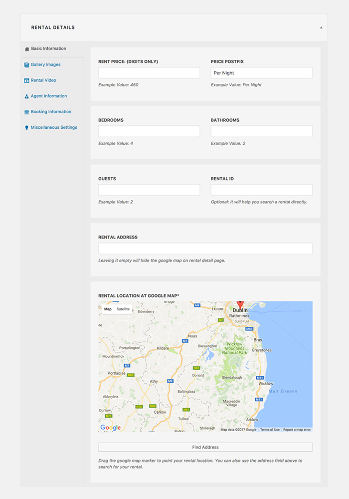
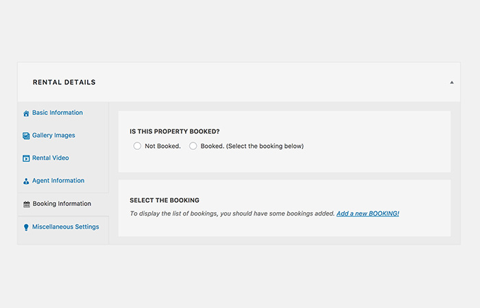
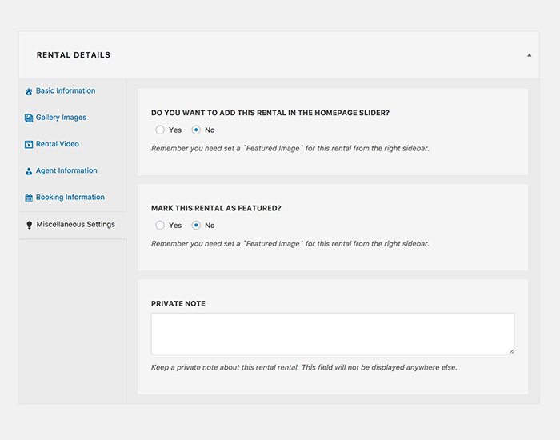
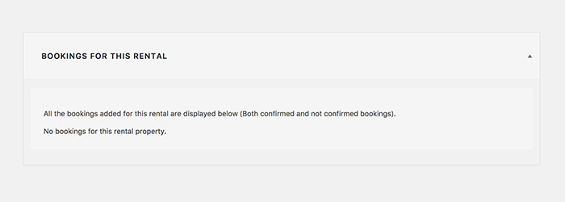
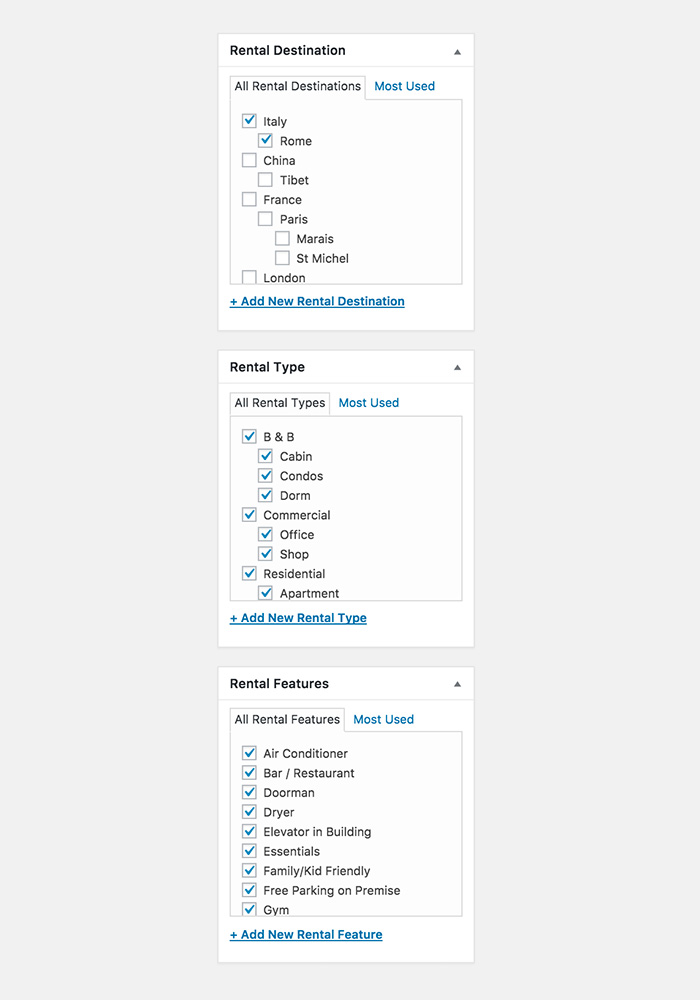

#RENTALS

!!!tip "TIP"
    `Rentals` are the backbone of `VacationRentals` theme. You can add all sorts of rental listings. You can also make custom rental listings. Exciting! Ain't it? :smile:

## Add a Vacation Rental Listing

Let's add a rental listing. Adding a vacation rental listing is easy. The process looks like.

!!!summary ""

    - **ACCESS** the WordPress admin dashboard.
    - **BROWSE** the menu called **Vacation Rentals**
    - **CLICK** `Add New`.

!!!tip "Click ADD NEW"

!!!tip "Add Title and Content for the Rental Listing."

### RENTAL DETAILS

To add rental details, scroll down below the content area to find a metabox called `Rental Details`. It looks like the following screenshot.

---

#### 1. BASIC INFORMATION

You can add following basic information to a rental listing.

!!!summary ""

    - **RENT PRICE**: (DIGITS ONLY) — Example Value: 450
    - **PRICE POSTFIX** — Example Value: Per Night
    - **BEDROOMS** — Example Value: 4
    - **BATHROOMS** — Example Value: 2
    - **GUESTS** — Example Value: 2
    - **RENTAL ID** — Optional: It will help you search a rental directly.
    - **RENTAL ADDRESS** — Leaving it empty will hide the Google map on rental detail page.
    - **RENTAL LOCATION** AT GOOGLE MAP*

---

#### 2. GALLERY IMAGES

You can add gallery images to a rental listing.

!!!summary ""

    - **ADD** rental listing media images — up to 48 files although more than 10 are not recommended to keep the web page size small.
    - **SIZE** of these images should be at least `1440px x 725px` (width x height).

---

#### 3. RENTAL VIDEO

You can add rental video to a rental listing.

!!!summary ""

    - **ADD** virtual tour video URL. YouTube, Vimeo, SWF File and MOV File are supported
    - **ADD** virtual tour video placeholder image. 
    - **SIZE** of this image should be at least `730px x 400px` (width x height).

#### 4. AGENT INFORMATION

You can add agent information to a rental listing to connect an agent with a rental.

!!!summary ""

    **AGENTS**: To display the list of agents, you should add agents here.

!!!warning ""
    Before adding any agent, there will be no list displayed. As shown below.

!!!success ""
    After adding agent(s) there will be a list of agents to choose from. As shown below.

<!-- #### 5. BOOKING INFORMATION

You can add booking information to a rental listing to add a booking to the rental.

!!!summary ""

    **BOOKING**: To display the list of bookings, you should have at least one booking here.

!!!warning ""
    Before you have any bookings, there will be no list displayed. As shown below.

!!!success ""
    After adding booking(s) there will be a list of booking to choose from. As shown below.

 -->
#### 5. MISCELLANEOUS SETTINGS

You can add several miscellaneous settings to a rental listing. E.g.

!!!summary ""

    - **DISPLAY** — Remember you need set a `Featured Image` for this rental from the right sidebar.
    - **MARK THIS RENTAL AS FEATURED?** - Remember you need set a `Featured Image` for this rental from the right sidebar.
    - **PRIVATE NOTE**: Keep a private note about this rental rental. This field will not be displayed anywhere else.

### BOOKINGS FOR THIS RENTAL

This metabox displays the bookings that are assigned to this particular rental.

!!!warning ""
    Before you have any bookings, there will be no list displayed. As shown below.

!!!success ""
    All assigned rental bookings (once assigned to this rental) will be displayed here. As shown below.

### MORE SETTINGS

There are a few more things you can do with your rental listings. E.g.

!!!summary ""

    - **SELECT** RENTAL DESTINATION
    - **SELECT** RENTAL TYPE
    - **SELECT** RENTAL FEATURES
    - **ADD** FEATURED IMAGE

!!!warning ""
    Before you have any rental destination, type, features added there will be no list displayed. As shown below.

!!!success ""
    Once added, you can select as many rental destination, type, features, as you want. As shown below.

