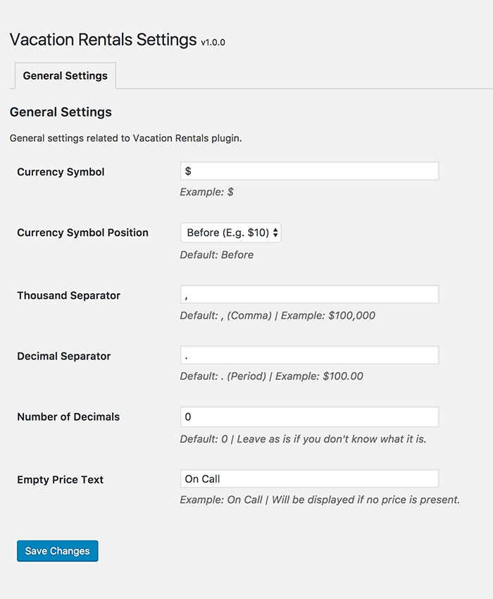

# SETTINGS

There are a few settings that you can change right from your dashboard. These settings are mentioned below.

## General Settings

General settings related to Vacation Rentals plugin.

!!!success ""
    - **Currency Symbol Example**: `$`
    - **Currency Symbol Position**: Default: Before
    - **Thousand Separator**: Default: `,` (Comma) | Example: $100,000
    - **Decimal Separator**: Default: `.` (Period) | Example: $100.00
    - **Number of Decimals**: Default: `0` | Leave as is if you don't know what it is.
    - **Empty Price Text**: Example: `On Call` | Will be displayed if no price is present.

