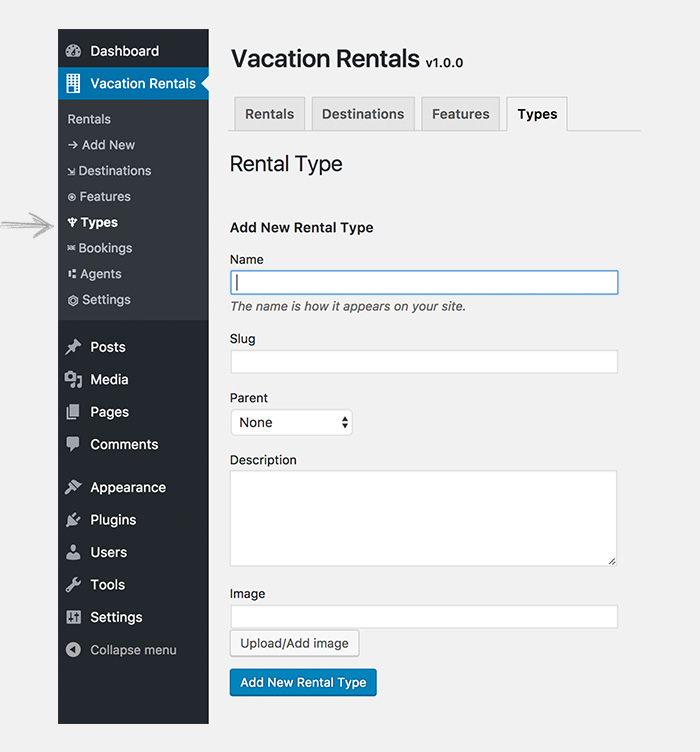

# RENTAL TYPES

!!!tip ""
    Rental types can be used to organize the rental listings as well as to show what type does a rental belong to.

## How to Add RENTAL TYPES?

To add a rental type follow the steps as mentioned.

!!!summary "Add RENTAL TYPES"
    - **GO TO**: WordPress admin dashboard > `Vacation Rentals > TYPES`.
    - **NAME**: The name is how type appears on your site.
    - **SLUG**: The “slug” is the URL-friendly version of the name. It is usually all lowercase and contains only letters, numbers, and hyphens.
    - **PARENT**: If the rental type has a parent select it here. E.g. `Office` type will have `Commercial` as its parent. 
    - **DESCRIPTION**: Add a description of your rental type here.
    - **UPLOAD/ADD IMAGE**: Make sure the image is not too small and not too big. Recommended size is 32px x 32px (Width x Height).
    - **CLICK**: `Add New Rental type`.

